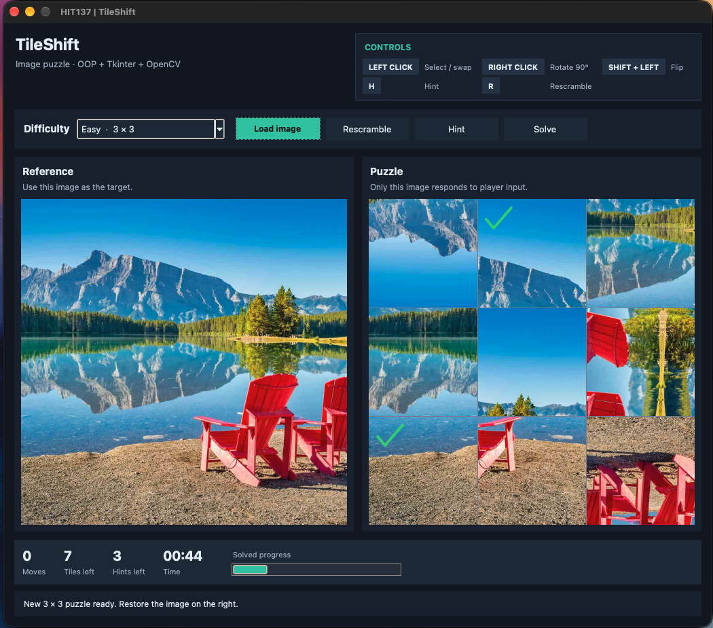
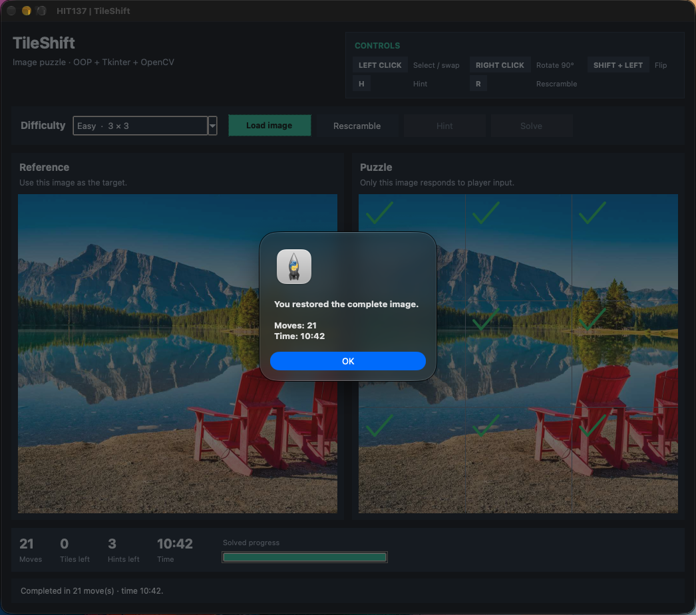

# HIT137 Assignment 3

## Image Puzzle Game

This repository contains the three-member implementation of the HIT137 Group Assignment 3 image puzzle game. The program uses Python, Tkinter and OpenCV and is started from the root `main.py` file.

## Team and completed work

| Member | Student ID | Main contribution |
|---|---|---|
| Trong Hieu Pham | S406541 | Member 1: core OOP and game state, including `Tile`, `PuzzleBoard`, `PuzzleGame`, selection, moves, hints, solving and completion state |
| Abishek Rajeshkumar | S367359 | Member 2: image loading and preparation, crop/pad strategies, grid splitting/reassembly, transformation hierarchy and random scrambling |
| Muid Khan Joy | S373799 | Member 3: Tkinter GUI, side-by-side display, mouse/keyboard interaction, overlays, counters, progress, timer, error messages, integration and final testing |

## Project structure

```text
.
├── Image
│   ├── game-ui-screen.png
│   ├── hello.jpg
│   └── solve-game-screen.png
├── Member 1
│   ├── game.py
│   ├── puzzle_board.py
│   └── tile.py
├── Member 2
│   ├── image_processor.py
│   └── transformations.py
├── Member 3
│   └── puzzle_gui.py
├── tests
│   └── test_core_integration.py
├── github_link.txt
├── main.py
├── README.md
└── requirements.txt
```

## Required features implemented

- JPG, JPEG, PNG and BMP image loading
- 3 × 3, 4 × 4 and 5 × 5 grids
- Aspect-ratio-preserving image preparation
- Even square tile sizes
- Random swap, rotate and flip transformations
- Transformation count scales with grid size
- No tile position targeted twice during the initial scramble
- Original image and puzzle displayed side by side
- Faint grid over the transformed image
- Left click to select, deselect and swap
- Right click to rotate 90 degrees clockwise
- Shift + left click to flip horizontally
- Green tick on tiles in the correct position and orientation
- Move counter and incorrect-tile counter
- Three-hint limit with blue markers
- Hint markers disappear after the next move
- Solve button
- Completion detection and input locking
- Cancelled dialog, invalid image and off-image click handling
- Full reset when another image is loaded

## Extra interface features

- Three named difficulty levels mapped to the required grid sizes
- Elapsed round timer
- Solved-progress bar
- Rescramble button for the current image
- Keyboard shortcuts for opening an image, hints and rescrambling
- Dark custom Tkinter theme
- Highlighted control guide in the top-right of the window
- Selection is always cleared after rotate, flip or swap so the visible border and logical selection always match
- Final correct-tile tick and 100% progress are rendered before the completion dialog appears
- Centralized GUI callback and move error handling


# Game Preview

##  Main Game Screen



##  Puzzle Solve Screen



## Setup

Create and activate a virtual environment.

### Windows

```bash
python -m venv .venv
.venv\Scripts\activate
```

### macOS / Linux

```bash
python3 -m venv .venv
source .venv/bin/activate
```

Install the Python packages:

```bash
pip install -r requirements.txt
```

## Run the application

Run from the repository root:

```bash
python main.py
```

If your system uses `python3` for Python 3:

```bash
python3 main.py
```

## Controls

| Input | Action |
|---|---|
| Left click | Select a tile |
| Left click another tile | Swap the two tiles |
| Left click selected tile | Deselect it |
| Right click | Rotate a tile 90° clockwise and clear any previous selection |
| Shift + left click | Flip a tile horizontally and clear any previous selection |
| Hint button or H | Show one incorrect tile and its correct home position |
| Rescramble button or R | Start a new scramble with the same image |
| Solve button | Restore the complete puzzle immediately |
| Ctrl + O | Open an image |

## Core test

The integration test checks all three grid sizes, transformation planning, unique scramble targets, hints, move counting, selection clearing after rotate/flip, and solving without opening the GUI.

```bash
python tests/test_core_integration.py
```

